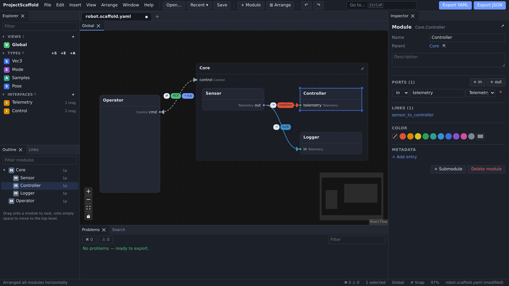

# ProjectScaffold

Browser editor for software architecture: modules, ports, typed interfaces and constrained links.
Exports a language-agnostic YAML/JSON file meant to feed code skeleton generators.



## Commands

```sh
npm install
npm run dev          # dev server with hot reload
npm run build        # typecheck + single self-contained dist-web/index.html
npm run preview      # serve the production build
npm test             # unit tests (model, serialization, validation)
npm run schema       # regenerate schema/scaffold.schema.json
npm run lint
```

`dist-web/index.html` works from `file://` or any static host. Files are read and written through the File System Access API when available (Chrome, Edge), otherwise through a file input and a download.

## Editor

### Workspace

- **Document tabs**: several projects open at once, each with its own undo history (Alt+N new, Alt+W close, Alt+1…9 / Alt+PageUp/PageDown to switch, middle click to close, drag to reorder). Open documents and their unsaved edits are restored after a page reload.
- **Dockable panels** (Explorer, Outline, Inspector, Problems, Search, Settings): drag a tab to dock it on any side, stack it with others or float it. The layout is kept; _Window › Reset panel layout_ restores the default one.
- **Views**: each document has a _Global_ view plus any number of stored views, opened as tabs and splittable side by side. _Open module in its own view_ (Alt+Enter, or ⤢ on a container) shows one module's content, with stand-ins for the outside modules it is linked to and a breadcrumb back to the parents. Modules can be hidden per view (H, or the eye in the Outline; Shift+H shows them again).
- **Editor tabs**: double-click a type or interface in the Explorer (or ↗ in the Inspector) to edit it in a tab of its own.
- **Command palette**: Ctrl+Shift+P (or F1) runs any command; Ctrl+P goes to a module, type, interface, link or view. `?` lists every shortcut.

### Diagram

- Double-click or right click the canvas for its menu; **+ Module** (Ctrl+M) adds a module. Drop a module onto another to nest it; drag it out to move it up.
- Ports: `in` on the left, `out` on the right — or `in` on top, `out` at the bottom in vertical orientation. Drag from an `out` port to an `in` port to create a link. Ports follow their links: on a module without submodules, each port (dot and name) moves to the edge facing the modules it is linked to — top / bottom for modules one above the other, left / right otherwise. Containers keep their ports on the default edges and their links leave from the facing side (_View › Auto-orient link ends_).
- Selection: click, Ctrl+click to add, Shift+drag for a box. Arrows move the selection (Shift: further), F fits it, Shift+F fits everything.
- **Copy / cut / paste / duplicate** (Ctrl+C / X / V / D) several items at once: modules with their content and the links between them, notes, types and interfaces — within a document, between document tabs, and between browser windows (system clipboard). Interfaces and types are matched by name when pasted into another project.
- Right click anything for its actions. F2 or double-click a module name to rename it in place.
- **Arrange**: _Auto-arrange_ (Ctrl+Alt+L) lays out the selected container's content, the view's module, or everything, with ELK (layered, port aware, nested modules). _Arrange horizontally_ (Ctrl+Alt+H) and _vertically_ (Ctrl+Alt+V) also set the document's orientation: ports on the sides with links flowing right, or ports and their names on the top / bottom edges with links flowing down (saved in `editor.orientation`). Align, distribute, same size and _Group into a module_ (Ctrl+G) act on the selection. Alignment guides and snap to grid while dragging.
- Module colors, sticky notes and titled frames (right click the canvas) help organize the diagram. They are editor data only.
- **Export diagram** as PNG or SVG (_File_ menu).

### Model

- Types (struct / enum / alias) and interfaces (messages with typed `in` / `out` / `inout` parameters and optional return) are listed in the Explorer. Type fields accept expressions with completion (`map<string, vector<uint16>>`), or the structured editor (⋮). Inspectors list where a type or interface is used.
- The **Problems** panel validates live (filter by severity or text). Errors block export, warnings do not.
- **Save** writes the project file (export format + `editor` section). **Export** writes the file without editor data.
- **Recent ▾** (toolbar) lists the last 10 opened/saved projects (exports excluded). Stored in IndexedDB (file handle + last content; reopening asks for file access again when needed).
- Settings (theme, link style and badges, grid, guides, minimap, arrange on open) are kept per browser.

## File format

Schema: [`schema/scaffold.schema.json`](schema/scaffold.schema.json) (JSON Schema 2020-12). Example: [`examples/robot.scaffold.yaml`](examples/robot.scaffold.yaml).

```yaml
schemaVersion: 1
project: { name, description?, metadata? }
types: [...] # struct | enum | alias
interfaces: [...] # named sets of messages
modules: [...] # recursive (modules[].modules)
links: [...]
editor: { layout, views?, style?, notes?, orientation? } # editor only, ignored by generators
```

### Types

A type reference is always structured (never a string):

| kind                             | fields         | notes                                                                                      |
| -------------------------------- | -------------- | ------------------------------------------------------------------------------------------ |
| `primitive`                      | `name`         | `bool char int8 int16 int32 int64 uint8 uint16 uint32 uint64 float32 float64 string bytes` |
| `array`                          | `of`, `size`   | fixed size                                                                                 |
| `vector` `list` `set` `optional` | `of`           |                                                                                            |
| `map`                            | `key`, `value` | key: primitive or enum                                                                     |
| `ref`                            | `name`         | user type (struct, enum or alias)                                                          |

User types: `struct` (`fields`), `enum` (`underlying` integer primitive, `values`), `alias` (`type`).

### Modules, ports, links

- Module path = dot-separated names (`Core.Sensor`); names unique among siblings.
- Port: `role` `out` (initiates / sends) or `in` (receives / serves), `interface` name.
- Link: `from` (an `out` port) → `to` (an `in` port), same interface, with `constraints`:

```yaml
constraints:
  direction: unidirectional | bidirectional # messages returning a value need bidirectional
  ack: { required: bool, timeoutMs? }
  performance: { class: realtime | low | normal | bulk, maxLatencyMs?, rateHz? }
  remote: { enabled: bool, transport? } # e.g. ipc, shm, tcp, udp, grpc, mqtt, can
```

All names are identifiers (`[A-Za-z_][A-Za-z0-9_]*`). Types and interfaces share one namespace.
