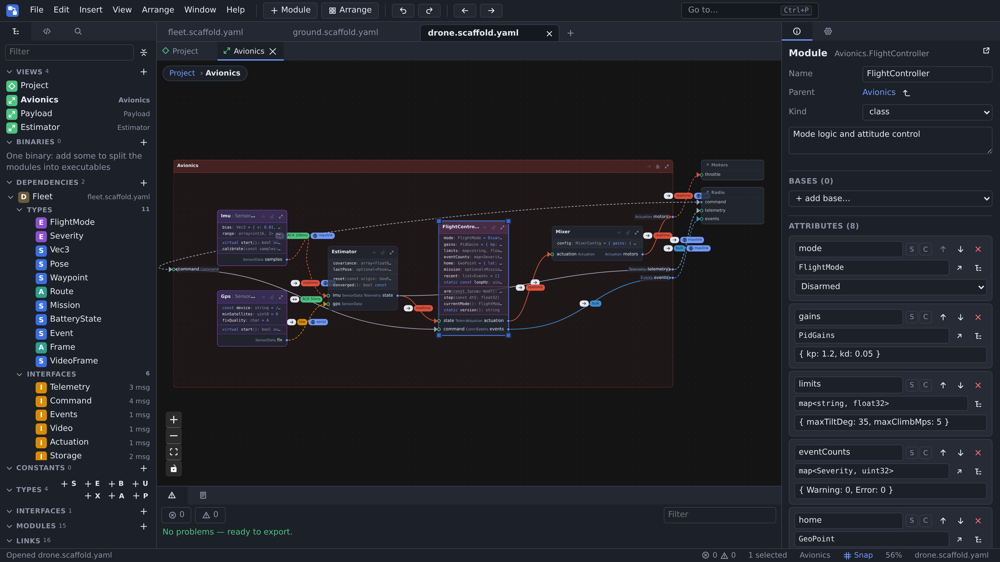

# ProjectScaffold

Browser editor for software architecture: modules, ports, typed interfaces and constrained links.
Exports a language-agnostic YAML/JSON file meant to feed code skeleton generators.



## Commands

```sh
npm install
npm run dev          # dev server with hot reload
npm run build        # typecheck + single self-contained dist-web/index.html
npm run preview      # serve the production build
npm test             # unit tests (model, serialization, validation)
npm run schema       # regenerate schema/scaffold.schema.json
npm run lint
npm run generate -- examples/robot.scaffold.yaml -d   # C++17 code, see Code generation
scripts/build_cli.sh # standalone code generator dist-cli/scaffold-gen, see Code generation
scripts/check_remote.sh  # calls between binaries: C++ and Python over every generated transport (cmake, python3)
scripts/build_all.sh # web, CLI, VS Code, desktop (Docker); args: [--check] [web|cli|vscode|desktop]...
```

Desktop app (Tauri), built in Docker for Linux amd64 (`.deb`, `.rpm`, `.AppImage`) and Windows amd64 (NSIS installer + portable `.exe`, needs WebView2):

```sh
scripts/build_tauri.sh   # -> dist-tauri/linux/, dist-tauri/windows/
npm run tauri dev        # local dev window (needs Rust + webkit2gtk-4.1)
```

Portable desktop app (Electron, bundles Chromium: no WebView2 needed), built in Docker for Linux x64 (`.AppImage`, `.tar.gz`) and Windows x64 (portable `.exe`, `.zip`):

```sh
scripts/build_electron.sh   # -> dist-electron/linux/, dist-electron/windows/
npm run electron            # local window from the web build
```

Both desktop apps at once (parallel, shared web build): `scripts/build_desktop.sh` (`docker buildx bake`).

VS Code extension: `*.scaffold.yaml` / `.yml` / `.json` files open in the full-window diagram (_Open in Full Diagram Editor_ from the explorer menu for any other YAML/JSON project file). As text (_Show Source_, or _Reopen Editor With… › Text Editor_), they have an editable diagram preview beside them (_Open Preview_ in the editor title, or Ctrl+K V), like the Markdown preview: on the left of the text by default (settings `projectScaffold.preview.position`, `projectScaffold.preview.showSideBar`). The file stays a VS Code text document (dirty state, save, hot exit, git diff). The text cursor and the diagram selection follow each other (setting `projectScaffold.syncSelection`). Undo in the preview undoes the diagram's changes; undo in the text, the text's. The app's Explorer, Modules, Links, Dependencies and Settings are views of the _ProjectScaffold_ side bar (activity bar), opened when a project file is first opened (`projectScaffold.views.revealOnOpen`), for the project file being edited: selecting there shows it in the diagram and the text. _Generate Code_ also runs from the text editor's title, the diagram's title, the ProjectScaffold Explorer view's title and the files' explorer menu: a preview opens for it when no diagram shows the file. Problems go to the VS Code Problems panel on the line of their entity; the outline to the Outline view and breadcrumbs of the text. Dependencies are refreshed from the files next to the document. With the theme setting _VS Code_ (the default), the colors are those of the VS Code color theme. While a diagram has the focus, its shortcuts win over VS Code's.

```sh
scripts/build_vscode.sh     # -> dist-vscode/project-scaffold-vscode-<version>.vsix (or: docker buildx bake vscode)
code --install-extension dist-vscode/project-scaffold-vscode-*.vsix
```

Development: `npm run build && npm run vscode:compile`, then `code --extensionDevelopmentPath="$PWD/vscode" examples` opens an Extension Development Host.

`dist-web/index.html` works from `file://` or any static host. Files are read and written through the File System Access API when available (Chrome, Edge), otherwise through a file input and a download.

## Editor

### Workspace

- **Document tabs**: several projects open at once, each with its own undo history (Alt+N new, Alt+W close, Alt+1…9 / Alt+PageUp/PageDown to switch, middle click to close, drag to reorder). Open documents and their unsaved edits are restored after a page reload.
- **Dockable panels** (Explorer, Modules, Inspector, Problems, Search, Settings): drag a tab to dock it on any side, stack it with others or float it. The layout is kept; _Window › Reset panel layout_ restores the default one. The Explorer's sections are reordered by dragging their header (or Alt+↑ / Alt+↓) and hidden from their right-click menu (_Reset sections_ restores them).
- **Views**: each document has a _Global_ view plus any number of stored views, opened as tabs and splittable side by side. _Open module in its own view_ (Alt+Enter, or ⤢ on a container) shows one module's content, with stand-ins for the outside modules it is linked to and a breadcrumb back to the parents, in a temporary tab (italic title, not saved in the file): _Keep view_ (double-click the tab, its right-click menu, the breadcrumb or _View › Keep view_) stores it with the document, closing the tab discards it. Modules can be hidden per view (H, or the eye in the Modules panel; Shift+H shows them again).
- **Editor tabs**: double-click a type or interface in the Explorer (or ↗ in the Inspector) to edit it in a tab of its own.
- **Text editor**: _View › Edit as text_ (Alt+U) opens the project file's YAML (or JSON) in a code editor (CodeMirror): syntax colors, folding, search and replace (Ctrl+F), multiple cursors, completion of the keys, values and names the file allows (Ctrl+Space), problems marked on their lines. Valid edits apply to the project after a pause (one undo step each); the element under the cursor is selected in the diagram (_Follow cursor_).
- **Command palette**: Ctrl+Shift+P (or F1) runs any command; Ctrl+P goes to a module, type, interface, link or view. `?` lists every shortcut.

### Diagram

- Right click the canvas for its menu, double-click it to zoom in (Shift+double-click to zoom out); **+ Module** (Ctrl+M) adds a module. Drop a module onto another to nest it; drag it out to move it up.
- Ports: `in` on the left, `out` on the right — or `in` on top, `out` at the bottom in vertical orientation. Drag between an `out` port and an `in` port to create a link; a container's `in` port links to an `in` port inside it, an `out` port inside to the container's `out` port. Or link modules directly: drag the → in a module's header onto another module (or one of its `in` ports), or drag a port onto a module; the missing `out` / `in` ports are added, typed with the other end's interface. Ports follow their links: on a module without submodules, each port (dot and name) moves to the edge facing the modules it is linked to — top / bottom for modules one above the other, left / right otherwise. Containers keep their ports on the default edges and their links leave from the facing side (_View › Auto-orient link ends_).
- **Link shape** (like draw.io): select a link, then drag its line to add a bend, drag a bend to move it (snaps to the grid and in line with its neighbours; Alt: free), double-click a bend to remove it. Drag an end square along its module's border to attach the link there; double-click it to attach at the port again. _Reset shape_ in the link's menu. Bends move with the module holding both ends, and with both ends when they are moved together; _Arrange_ clears them. Saved in `editor.links`.
- Selection: click, Ctrl+click to add, Shift+drag for a box. Arrows move the selection (Shift: further), F fits it, Shift+F fits everything.
- **Copy / cut / paste / duplicate** (Ctrl+C / X / V / D) several items at once: modules with their content and the links between them, notes, types and interfaces — within a document, between document tabs, and between browser windows (system clipboard). Interfaces and types are matched by name when pasted into another project.
- Attributes: listed as `name: type = default` in a compartment below the module's header, apart from the ports on its border where links attach. Edit them in the module's inspector, with their default value: a choice for `bool` and enums, a YAML flow literal checked against the type otherwise (the placeholder shows the expected shape).
- Methods: prototypes listed as `static name(const a: T, out b: U): R const` in a compartment below the attributes. Edit them in the module's inspector like interface messages — parameters with their direction, an optional return type — with their `static` and `const` qualifiers, and `const` on `in` parameters.
- Attributes and methods can be `static` and `const` (checkboxes in the inspector), shown before their name on the canvas.
- C++-like classes: a module's _Kind_ is `class` (concrete, default), `abstract` or `interface` (only pure methods, no attributes), shown as `«interface» Name` in italics; its _Bases_ are modules it derives from, shown as `Name : Base` and as UML arrows from the module to each base (hollow triangle, dashed to an interface; click selects the module, right click goes to or removes the base; _View › Inheritance arrows_ hides them). Methods can be `virtual`, `pure` (`= 0`) and `override`, shown as `virtual name(): R const override = 0`. _Implement_ in the Methods section adds the pure methods a module inherits and lacks, as overrides.
- Right click anything for its actions. F2 or double-click a module name to rename it in place.
- **Arrange**: _Auto-arrange_ (Ctrl+Alt+L) lays out the selected container's content, the view's module, or everything, with ELK (layered, port aware, nested modules). _Arrange horizontally_ (Ctrl+Alt+H) and _vertically_ (Ctrl+Alt+V) also set the document's orientation: ports on the sides with links flowing right, or ports and their names on the top / bottom edges with links flowing down (saved in `editor.orientation`). Align, distribute, same size and _Group into a module_ (Ctrl+G) act on the selection. Alignment guides and snap to grid while dragging. With _Select before moving_ (setting, on by default) only selected items move when dragged; dragging others pans the view.
- **Binaries** (executables): add them in the Explorer's _Binaries_ (+) or the project inspector (name, color), then pick each top-level module's _Binary_ in its inspector or its menu (_Binary ›_, for the whole selection). A module shows its binary in its header. Links between two binaries become remote (dashed): choose their transport; links back inside one binary become local again when they have none. A module moved into a container runs in the container's binary; one moved out keeps running where it ran.
- **Dependencies** (another project file used by this one): _Insert › Add dependency…_ (or + in the Explorer's _Dependencies_) picks an open document, or several project files and IDL files at once (_Open files…_), whose types and interfaces this project then uses, read-only, like its own ones (one namespace). Its modules can be linked to: _Insert › Link to another project…_ (or the canvas menu) picks a dependency or another project, then one of its modules, which is drawn in the global view (dashed, `↗ Project`, resizable) with ports linked to like any other; the project becomes a dependency if it was not one, so the interfaces of its ports are used here, not copied. The dependencies of a dependency come with it (`indirect`), read from their own files when they can be (open tab, or next to the document in VS Code), else as that dependency last read them. An IDL file can be a dependency too: it stands for a project named after the file (types, interfaces, constants, components as modules to place), the files it includes being its dependencies; `scaffold-gen -d` generates it like a project file. A name defined both here and in a dependency is taken only when both definitions are the same (the entity becomes the dependency's); two dependencies defining a name the same way share it; a different definition is left out, with a warning. See [`examples/common.scaffold.yaml`](examples/common.scaffold.yaml) (types and interfaces only), used by [`examples/robot.scaffold.yaml`](examples/robot.scaffold.yaml), both used by [`examples/station.scaffold.yaml`](examples/station.scaffold.yaml), which links to a module of the robot. Edits made in a dependency's open tab reach the documents using it at once; files that are not open catch up on _Refresh dependencies_ (types and interfaces no longer there but still used here stay, as own ones; links to removed ports are dropped). In the Explorer and the _Dependencies_ panel, a dependency opens, refreshes, places a module on the canvas, is removed (when nothing here uses it) or _detached_ (its types and interfaces become this project's own). Double-click a placed module to switch to its project's tab.
- **Import projects or IDL files** (_Insert_ menu, or right click the canvas / a module): copies the whole content of an open document, or of several project files at once, into the selected module (or here), one below the other: their modules with their links, their notes at the top level, and the types and interfaces this project lacks — the others are matched by name. The copy is not linked to those projects, but their dependencies become this project's (a picked project another one depends on is copied first and stands for that dependency).
- **IDL files** picked there: reads OMG IDL files (IDL 4.2: CORBA, CCM, DDS / XTypes) and adds one of their interfaces or components, or all, with the types they use (files without interfaces nor components: all their types). Types and interfaces this project has by name are used as they are.
  - Preprocessor: `#include` and IDL `import "file";` (VS Code reads included files next to the IDL file and in its parent folders; elsewhere pick them along with it), `#define` (function-like, `#`, `##`), `#undef`, `#if` / `#ifdef` / `#ifndef` / `#elif` / `#else`, `#error`; `#pragma` is ignored.
  - Modules are flattened: entities keep their simple name, qualified with their modules (`Robot_Status`) when several share it. Scoped names (`::A::B`, inherited scopes) are resolved; template modules are instantiated (`module Buffers<long, 8> Longs;`).
  - `struct` (base fields included), `exception` (a struct), `union` (a struct of its discriminator and one optional field per case), `enum`, `bitmask` (an enum of flags), `bitset` (a struct of its bitfields), `typedef`, `native`, sequences (`sequence<octet>`: `bytes`), maps, arrays and bounded strings map to the model; constant expressions are evaluated. Annotations: `@optional`, `@default` (field default), `@value`, `@position`, `@bit_bound` (underlying type), `@unit` and `@range` / `@min` / `@max` (in the description).
  - Interfaces: operations become messages (`in` / `out` / `inout`, `void`: no return; raised exceptions in the description, imported with them), attributes `get_<name>` / `set_<name>` messages, base interfaces' operations are copied in. Valuetypes and eventtypes become structs of their state members (abstract ones: interfaces; value boxes: optional aliases).
  - Components and connectors become modules: `provides` / `consumes` are `in` ports, `uses` / `emits` / `publishes` `out` ports (events through a `<Event>Consumer` interface with a `push` message), `port` / `mirrorport` expand their porttype, attributes become module attributes, supported interfaces module methods, the base component the module's base. Homes are left out.
  - References to interfaces (`Object`, interface names as types) become `<Name>Ref` custom primitives; names defined nowhere, custom primitives (empty interfaces for ports). Doc comments become descriptions. The dialog lists what was approximated.
  - Examples in [`examples/idl/`](examples/idl): `robot_control.idl` (CORBA-style interfaces, attributes, inheritance, exceptions), `sensors_dds.idl` (DDS types only: annotations, bitmask, union, bounded sequences, maps), `tank_ccm.idl` (CCM components, porttypes and events; includes `sensors_dds.idl`), `navigation.idl` (uses `Pose` and `Vec3` without defining them: import it into `examples/robot.scaffold.yaml` to see them matched by name).
- **Renames stay in sync** with dependencies: renaming a module (or a parent), a port, a type or an interface in one project renames it in the open projects depending on it. Each document gets the change as its own undoable edit (and becomes unsaved). Files that are not open catch up on _Refresh dependencies_: a placed module no longer found by path is matched to the only other module with the same name (moved) or the same ports (renamed); the dialog lists what was renamed.
- Module colors, sticky notes and titled frames (right click the canvas) help organize the diagram; dragging a frame moves what lies fully inside it. They are editor data only.
- **Export diagram** as PNG or SVG (_File_ menu).

### Model

- Types (struct / exception / enum / bitmask / union / alias / custom primitive), constants (edited in the project inspector) and interfaces (messages with typed `in` / `out` / `inout` parameters and optional return) are listed in the Explorer. Type fields accept expressions with completion (`map<string, vector<uint16>>`), or the structured editor (⋮). Inspectors list where a type or interface is used.
- The **Problems** panel validates live (filter by severity or text). Errors block export, warnings do not.
- **Save** writes the project file (export format + `editor` section). **Export** writes the file without editor data.
- **Recent ▾** (toolbar) lists the last 10 opened/saved projects (exports excluded). Stored in IndexedDB (file handle + last content; reopening asks for file access again when needed).
- Settings (theme, link style and badges, port style (dots, arrows, hollow, shapes) to tell `in` from `out`, grid, guides, select before moving, minimap, arrange on open) are kept per browser.

## File format

Schema: [`schema/scaffold.schema.json`](schema/scaffold.schema.json) (JSON Schema 2020-12). Example: [`examples/robot.scaffold.yaml`](examples/robot.scaffold.yaml).

```yaml
schemaVersion: 1
project: { name, description?, metadata? }
binaries: [...] # executables the top-level modules are split into (optional)
types: [...] # struct | enum | bitmask | union | alias | primitive
interfaces: [...] # named sets of messages
constants: [...] # named values: { name, description?, type, value } (optional)
modules: [...] # recursive (modules[].modules)
links: [...]
dependencies: [...] # other project files whose types, interfaces and modules this one uses (optional)
editor: { layout, views?, style?, notes?, dependencies?, orientation?, links? } # editor only, ignored by generators
```

### Workspace files

A large architecture is split into project files depending on each other (see [Dependencies](#dependencies)). A workspace file (`*.scaffold-workspace.yaml`, schema [`schema/scaffold-workspace.schema.json`](schema/scaffold-workspace.schema.json)) lists them, to open them all at once:

```yaml
schemaVersion: 1
workspace: { name, description? }
projects: # relative to the workspace file, opened in tabs in this order (the first one shown)
  - ground.scaffold.yaml
  - drone.scaffold.yaml
  - shared/units.scaffold.yaml
```

_File › Open…_ on a workspace file opens its projects; the browser and desktop apps then ask for the folder holding it, to read them (files outside that folder cannot be read). Folders picked this way are remembered: a workspace file inside one of them, at any depth, opens without asking again (at most a permission prompt after a restart), so picking a parent folder once covers all the workspaces under it. Projects already open with unsaved changes are kept. _File › Save workspace_ rewrites the workspace last opened or saved with the open project files, _Save workspace as…_ writes a new one. Example: [`examples/fleet/fleet.scaffold-workspace.yaml`](examples/fleet/fleet.scaffold-workspace.yaml). Not in VS Code, which opens project files one by one.

### Types

A type reference is always structured (never a string):

| kind                  | fields                | notes                                                                                                                                 |
| --------------------- | --------------------- | ------------------------------------------------------------------------------------------------------------------------------------- |
| `primitive`           | `name`, `max`         | `bool char int8 int16 int32 int64 uint8 uint16 uint32 uint64 float32 float64 string bytes`; `max` (string, bytes): most bytes (UTF-8) |
| `array`               | `of`, `size`          | fixed size                                                                                                                            |
| `vector` `list` `set` | `of`, `max`           | `max`: most items                                                                                                                     |
| `optional`            | `of`                  |                                                                                                                                       |
| `map`                 | `key`, `value`, `max` | key: primitive or enum; `max`: most entries                                                                                           |
| `ref`                 | `name`                | user type (struct, enum or alias)                                                                                                     |

Bounds (`max`, optional) are written `string<16>`, `bytes<4>`, `vector<T, 8>`, `map<K, V, 8>` in type expressions; default values are checked against them.

User types: `struct` (`fields`, each with an optional `default`, as for attributes below), `enum` (`underlying` integer primitive, `values`), `bitmask` (`underlying` unsigned primitive, `flags`: `name` and `bit`, value `1 << bit`; its values are lists of flag names, `[Read, Write]`), `union` (`discriminator`: integer primitive, `bool`, `char` or enum; `cases`, each with `labels`, discriminator values selecting it, or `default: true`; its values are one-entry mappings, `{ radius: 2.5 }`), `exception` (`fields`, as a struct's; only raised: listed by the `raises` of messages and methods, `raises: [Busy]`, never used as a type), `alias` (`type`).

### Modules, ports, links

- Module path = dot-separated names (`Core.Sensor`); names unique among siblings.
- Attributes (optional): typed properties of a module, `{ name, static?, const?, type, description?, default? }` like struct fields. `static`: shared by all instances of the module; `const`: not changed after initialization.
- Methods (optional): method prototypes of a module, `{ name, description?, static?, const?, virtual?, pure?, override?, params, returns, raises? }` like interface messages; names unique among the module's methods and attributes. `static`: called without a module instance; `const`: leaves the module's state unchanged (not both). `virtual`: can be overridden by derived modules (not `static`); `pure`: pure virtual, `= 0`; `override`: overrides a virtual method of a base, same parameters (types, directions, `const`), return type and `const`. `pure` and `override` require `virtual`. Parameters take `const: true` too, `in` parameters only.
- Kind (optional): `class` (default, left out), `abstract` or `interface`. A `class` has no pure methods and implements every pure method it inherits; an `interface` has only pure methods and no attributes.
- Bases (optional): `bases: [IShape, Core.Base]`, paths of modules of this project it derives from, in order; no cycles, no repeats. A method redefining a virtual one of a base without `override` is a warning.
- Default values (`default`, attributes and struct fields): a YAML value checked against the type, aliases followed — `true` / `false`, an integer in range, a number, one `char`, text for `string` / `bytes` (quoted when it reads as something else: `"5"`), an enum value name, a list for `array` (exactly its size), `vector`, `list` and `set` (no duplicates), a mapping for `map` (keys read as the key type) and structs, `null` for an empty `optional`. A struct value names its fields: unknown and missing fields are errors, except fields with their own default, `optional` fields and structs whose fields all have one. Values of custom primitives are opaque, passed as is to generators. In the editor, write them as one-line flow literals: `{ position: { x: 1, y: 2 }, samples: [ 1, 2, 3 ] }`.
- Port: `role` `out` (initiates / sends) or `in` (receives / serves), `interface` name.
- Binaries (optional): `binaries: [{ name, description?, color? }]`, the executables the project is split into. Then every top-level module names the one it runs in (`binary: Onboard`; inner modules run in their ancestor's), and a link between modules of two binaries must be remote, with a transport (errors otherwise). Without binaries, the project is one executable.
- Link: `from` (an `out` port) → `to` (an `in` port), same interface — or, between a module and its content, `in` → `in` into it and `out` → `out` out of it — with `constraints`:

```yaml
constraints:
  direction: unidirectional | bidirectional # messages returning a value need bidirectional
  ack: { required: bool, timeoutMs? }
  performance: { class: realtime | low | normal | bulk, maxLatencyMs?, rateHz? }
  remote: { enabled: bool, transport?, settings? } # e.g. ipc, shm, tcp, udp, grpc, mqtt, can
```

- Transport settings (optional, `remote.settings`), by transport: tcp, udp, grpc `client` / `server` (`{ host?, port? }`: where the caller connects, where the callee listens); http, websocket the same plus `path` (default `/<link>`); shm `name` (segment, default `<project>_<link>`) and `capacity` (bytes of each ring, default 1048576); ipc `socket`; mqtt `broker` (`{ host?, port? }`) and `topic`; can `interface` and `id`; serial `device` and `baud`. `options` (string map) on any transport, custom ones included, for the templates. A field not applying to the transport is a warning; a http path not starting with `/`, an invalid shared memory name are errors; two links listening on the same port, or sharing a segment, are warnings.
- Remote defaults (optional, top level): `remoteDefaults: { client?: { host? }, server?: { host? }, basePort? }` — hosts of both ends (default `127.0.0.1`) and port of the first link between binaries (default 47000), for the links without settings of their own.

### Dependencies

Other project files whose types and interfaces are used here by name as if they were this project's (one namespace), and whose modules links may reach. Each keeps a copy of what is used as last read (so the file stays self-contained for generators):

```yaml
dependencies:
  - name: Robot # referenced by `uses` and link ends
    file: robot.scaffold.yaml # relative to this file
    uses: [Common] # dependencies of this list that its types and interfaces use (optional)
    types: [...] # its own types, as in `types`
    interfaces: [...] # its own interfaces, as in `interfaces`
    constants: [...] # its own constants, as in `constants` (optional)
    modules: # its modules placed on this canvas, with their ports (optional)
      - module: Core.Sensor
        ports: [{ name: out, role: out, interface: Telemetry }]
  - name: Common
    file: common.scaffold.yaml
    indirect: true # only here because another dependency uses it (optional)
    shared: [Vec3] # defined the same way by another dependency of this list, listed there (optional)
    types: [...]
    interfaces: [...]
links:
  - name: sensor_to_monitor
    from: { project: Robot, module: Core.Sensor, port: out }
    to: { module: Monitor, port: telemetry }
    constraints: { ... }
```

Generators read the project's `types` and `interfaces` plus those of every dependency. A dependency's types and interfaces only reference their own dependency's and those of the dependencies it `uses`. A placed port's interface is matched by name with those of this project and its dependencies. One end of a link must be in this project.

All names are identifiers (`[A-Za-z_][A-Za-z0-9_]*`). Types, interfaces and constants share one namespace; a constant's value is checked against its type, as default values are.

## Code generation

The code of a project is generated from [LiquidJS](https://liquidjs.com) templates. The built-in set, [`templates/cpp17`](templates/cpp17), writes a C++17 CMake project. Hand-written code goes into **user sections**, kept when the code is generated again:

```cpp
bool Controller::setMode(const ::common::Mode mode)
{
    // <user:method.setMode>
    return mode != ::common::Mode::Fault; // kept across generations
    // </user:method.setMode>
}
```

- Command line: `npm run generate -- <project file> [-o <dir>] [-t <template dir>] [--deps] [--force] [--prune] [--dry-run]`. The default output directory is `generated/<project>` next to the project file; `--deps` also generates the dependencies, each in a sibling directory (where the generated `CMakeLists.txt` looks for them). The exit code is not 0 on errors or conflicts. `scripts/build_cli.sh` (or `npm run cli`) builds the same command into a standalone executable, `dist-cli/scaffold-gen` (Node embedded, built-in templates included: `scaffold-gen <project file> [options]`), and a single-file script, `dist-cli/scaffold-gen.cjs` (run with Node 22+); an argument names another Node binary of the same version to embed, such as its Windows `node.exe` (→ `scaffold-gen.exe`).
- Editor: _File › Generate code_ (Ctrl+Alt+G) writes into the directory last used for the document, _Generate code into…_ picks another one (Chrome, Edge, the desktop apps; not Firefox / Safari). VS Code: _ProjectScaffold: Generate Code_ writes into `generated/<project>` next to the file (setting `projectScaffold.generate.outputDir`), _Generate Code Into…_ picks another directory, remembered for the file.
- The project must have no errors (like export). Generating again rewrites only what changed:
  - the content of each user section is carried over by id; sections still holding what was generated in them take the new template's content;
  - sections with no place left (a renamed method, module or port) are appended to `<file>.orphans`, never lost;
  - a file changed **outside** its user sections is left as it is and reported as a conflict (`--force` overwrites it);
  - files no longer generated are reported; `--prune` deletes them (their user sections go to `.orphans` files).
  - `.scaffold-gen.json` in the output directory records what was generated (keep it with the code).
- Templates: _File › Code templates…_ picks the template folder of the document, used until _Default templates_ is picked again (remembered for the document, read again at each generation: edits to the templates apply at once); _Copy the built-in templates into a folder…_ starts a set of one's own from the C++17 one. By default a template set in `<output directory>/.scaffold/templates/` is used instead of the built-in one. Command line: `-t <dir>`; VS Code: _ProjectScaffold: Code Templates…_, or setting `projectScaffold.generate.templates` (folder relative to the project file).
- [`examples/rover.scaffold.yaml`](examples/rover.scaffold.yaml) is made of modules with ports only (no attributes nor methods): frames, detections, drive commands, lifecycle and health calls between a camera, a perception container (with its content wired through its ports), a planner, motors, a recorder and a supervisor. It is split into two binaries: `Onboard` (the rover) and `Ground` (the supervisor), linked over TCP. `npm run generate -- examples/rover.scaffold.yaml` writes it into `examples/generated/rover`: executables `rover_onboard` and `rover_ground`.

### C++17 mapping

| Model                                                                  | C++                                                                                                                                                                                                                                                                                                                                                                                                                                                                                                                                                           |
| ---------------------------------------------------------------------- | ------------------------------------------------------------------------------------------------------------------------------------------------------------------------------------------------------------------------------------------------------------------------------------------------------------------------------------------------------------------------------------------------------------------------------------------------------------------------------------------------------------------------------------------------------------- |
| project `Robot`                                                        | namespace `robot`, CMake library `robot` (+ executable `robot_app` when there are modules)                                                                                                                                                                                                                                                                                                                                                                                                                                                                    |
| struct / exception / enum / bitmask / union / alias / custom primitive | `struct` with default member initializers (an exception derives from `std::exception`, `what()` its name; `@throws` in the docs of the messages raising it) / `enum class X : std::uint8_t` / `enum class` of the flags with `\|`, `&`, `^`, `~` and `has(value, flags)` / class holding a `std::variant`, with `_d()` (discriminator), a getter per case and a setter taking the discriminator (its first label by default), `_default(d)` when no case is the default / `using` / `using X = …` in a user section, one header each in `include/<ns>/types/` |
| primitives, containers                                                 | `std::int32_t`, `float`, `double`, `std::string`, `std::vector<std::uint8_t>` (bytes), `std::array`, `std::vector`, `std::list`, `std::set`, `std::optional`, `std::map`                                                                                                                                                                                                                                                                                                                                                                                      |
| constants                                                              | `inline constexpr` (numbers, enums, bitmasks) or `inline const` values in `include/<ns>/constants.hpp`; Python: `constants.py` (those of the types of `data.py`)                                                                                                                                                                                                                                                                                                                                                                                              |
| interface `Telemetry`                                                  | abstract class `ITelemetry` (pure virtual messages) in `include/<ns>/interfaces/`                                                                                                                                                                                                                                                                                                                                                                                                                                                                             |
| parameters                                                             | `in`: by value for scalars and enums, else `const T&`; `out` / `inout`: `T&`                                                                                                                                                                                                                                                                                                                                                                                                                                                                                  |
| module `Core.Sensor`                                                   | class `robot::core::Sensor` (`include/robot/core/Sensor.hpp`, `src/core/Sensor.cpp`); `kind`, `bases`, `static` / `const` / `virtual` / `= 0` / `override` as written; attributes are private members `name_` with a getter and a setter (unless `const`, or a method has that name)                                                                                                                                                                                                                                                                          |
| `out` port `out: Telemetry`                                            | `OutPort<ITelemetry>& out()` (`include/<ns>/ports.hpp`): `out()->publish(…)` for its single peer, `out().each(…)` for all                                                                                                                                                                                                                                                                                                                                                                                                                                     |
| `in` port `telemetry: Telemetry`                                       | `ITelemetry& telemetry()`, whose calls land in `onTelemetryPublish(…)`, written in the `.cpp`                                                                                                                                                                                                                                                                                                                                                                                                                                                                 |
| nested modules                                                         | members of their container, with accessors (`core().sensor()`); abstract ones with ports are `std::unique_ptr`, created in a user section; abstract ones without ports are only base classes                                                                                                                                                                                                                                                                                                                                                                  |
| links                                                                  | `from.connect(to)` in the constructor of the innermost module holding both ends, or of `robot::System` (the top-level modules, created by `src/main.cpp`); remote links in a user section, to replace by a transport; links to other projects: a user section in `System`                                                                                                                                                                                                                                                                                     |
| binaries `Onboard`, `Ground`                                           | one system per binary, `robot::OnboardSystem`, created by `src/onboard/main.cpp` (CMake executable `robot_onboard`); a link between two binaries calls a `remote::TelemetryProxy` (`include/<ns>/remote/`, implements `ITelemetry`) in the calling binary and is received by a `remote::TelemetryStub` bound to the `in` port in the other, both opened on the link's transport by the system (see below)                                                                                                                                                     |
| container port linked inside                                           | `in`: the accessor returns the inner port; `out`: the inner port forwards to it                                                                                                                                                                                                                                                                                                                                                                                                                                                                               |

Names that are C++ keywords get a trailing `_` (a warning tells; the keywords are the manifest's `reserved`). The types and interfaces of dependencies are included from their own generated code (`<common/types/Pose.hpp>`, namespace `common`).

### Links between binaries

When a project has links between binaries, the C++17 set also writes their transports and, in `python/<ns>/`, Python peers of the binaries speaking the same protocol, to test a binary without the others:

- Transports **tcp**, **udp**, **http**, **websocket** and **shm** (shared memory) are generated (`include/<ns>/remote/transport.hpp`, `src/remote/transport.cpp`; POSIX, threads): the system of the calling binary opens its proxy with `remote::connect(…)`, the other serves its stub with `remote::serve(…)`, and its `main` waits for SIGINT / SIGTERM. Other transports keep a user section, where a `remote::Channel` / `remote::Server` of your own goes. The calls reach the bound `in` port on the transport's threads (several at once over tcp, http and websocket).
- Addresses: the client connects to environment variable `<PROJECT>_<LINK>` (e.g. `ROVER_SUPERVISE_CAMERA=10.0.0.2:47000`), else the link's `client` setting; the server listens on `<PROJECT>_<LINK>_LISTEN`, else its `server` setting (and the client connects again after a failure). Unset host and port come from `remoteDefaults`: `127.0.0.1:<47000 + index of the link>` by default. shm: the name of the segment (`name`, `<project>_<link>` by default), made by the server with rings of `capacity` bytes. Settings of transports not generated are listed in their user sections (`r.link.constraints.remote.settings` in templates; resolved ones, defaults applied, in `r.settings`).
- A call waits for its reply when it has a result (return value, `out` / `inout` parameters) or its link has `ack.required`, within `ack.timeoutMs` (default 5000 ms); otherwise it is sent and forgotten. Failures (timeout, transport, an exception in the called binary) throw `remote::Error` / raise `RemoteError`; the exceptions a message `raises` come back as such (thrown by the proxy, `catch (const Busy&)` / `except data.Busy`).
- Wire format (`remote/wire.hpp`, `wire.py`): little-endian; `bool`, `char`: 1 byte; strings and `bytes`: u32 length + bytes (UTF-8); `vector`, `list`, `set`: u32 count + items; `array`: its items; `optional`: u8 flag + value; `map`: u32 count + keys and values; structs: their fields in order; enums, bitmasks: their underlying type; unions: the discriminator, then the case it selects (nothing for none); custom primitives: written by hand in user sections (`codec.hpp`, `data.py`). Bounds (`string<16>`, `vector<T, 8>`) are checked when encoding and decoding: a value over its bound throws `remote::Error` / raises `RemoteError`. A frame is a 16-byte header — magic `SCF1`, u8 kind (1 call, 2 reply, 3 error), u8 flags (1: reply wanted), u16 message (index in the interface), u32 call id, u32 payload length — then the inputs (`in`, `inout`) of a call, or the result then the outputs (`out`, `inout`) of a reply, or the error text (then, flag 2, the u16 index of the exception in the `raises` of the message and its fields). tcp: frames back to back; udp: a datagram per frame (64 KB at most); http: `POST <path>` with the frame as body, answered by the reply frame (200) or nothing (204); websocket: `GET <path>`, a binary message per frame; shm: POSIX segment holding two rings (calls, replies; 1 MiB each by default) of length-prefixed frames, made by the server (one client per link).
- Python (3.8+, standard library only): `data.py` (dataclasses, exceptions as dataclasses deriving from `Exception`, unions as dataclasses `(d, value)`, `IntEnum`s, `IntFlag`s), `remote/<interface>.py` (`<I>Proxy` whose calls give back their return value then their outputs, as a tuple when there are several; `<I>Handler` to override, logging and answering default values by default; `<I>Stub`), `links.py`, and one peer per binary, `peers/<binary>.py`, standing in for it: it serves the links the binary receives into handlers, and has a proxy per link it calls:

  ```python
  from rover.peers.ground import GroundPeer   # from generated/rover/python

  with GroundPeer() as ground:                # calls the real rover_onboard
      print(ground.supervise_camera.start(), ground.supervise_perception.health())
  ```

  `python -m rover.peers.onboard` runs a peer of the onboard binary until Ctrl-C (its `main` is a user section).

- `scripts/check_remote.sh` generates [`tests/fixtures/relay.scaffold.yaml`](tests/fixtures/relay.scaffold.yaml) (a link per transport, every kind of type), builds it with [`tests/remote/interop.cpp`](tests/remote/interop.cpp) and checks every call C++ → Python, Python → C++ and Python → Python over each transport.

### Writing templates

A template set is plain files, editable at will: everything specific to the target language lives in its templates, the generator only gives them the project and a few language-neutral helpers. In `templates/cpp17`, the `_*.liquid` partials spell the C++ of the model (`_type`: type references, `_value`: default values as literals, `_params`, `_input`, `_scalar`: parameter passing, `_name`, `_id`, `_accessor`, `_member`: names, `_ns`, `_qualified`, `_header`, `_source`: namespaces and files, `_includes`, `_endpoint`: wiring expressions; `_address`, `_address_variable`, `_generated_transport`: links between binaries), and the `_py_*.liquid` ones its Python (`_py_type`, `_py_value`, `_py_zero`, `_py_encode`, `_py_decode`…); the other templates use them with ``.

A template set is a directory with a `manifest.yaml`:

```yaml
name: cpp17
comment: '//' # starts the user section markers
reserved: alignas alignof and … # names of the model among them are warned about (`generator.reserved`)
partials: [_banner.liquid, _type.liquid] # used by  /  only, named without `.liquid`
outputs:
  - template: module.hpp.liquid
    each: modules # one file per item, bound to `item` (`as:` renames it)
    when: item.kind != 'interface' # optional condition
    path: "include/"
  - template: CMakeLists.txt.liquid
    path: CMakeLists.txt
    comment: '#'
```

- `default` writes a user section (`id`: any Liquid expression, unique in the file); its markers take the indentation of the tag's line. A line holding only a tag (``, ``, ``…) leaves no line (`trimTagLines: false` keeps them); runs of blank lines are collapsed (`squeezeBlankLines: false`). Logic reads best in a `` block (one tag per line, `echo` to write).
- Variables, in every template and partial (every value is present: templates run with strict variables): `project` (`name`, `ident`, `description`, `metadata`), `types` and `interfaces` (the project's own), `allTypes`, `allInterfaces` (with the dependencies'), `modules` (all, depth first: `name`, `path`, `namespace`, `parent`, `kind`, `abstract`, `bases`, `isBase`, `attributes`, `methods`, `ports` with their `interface` and `delegates`, `children`, `instances`, `connections`, `metadata`), `systems` (one per binary, or the only one: `name`, `binary`, `instances`, `connections`, `external` links to other projects, `proxies` and `stubs`: links calling or called from another binary, with `local`, `interface` and `peer`), `system` (the only system, null when the project has binaries), `binaries` (`name`, `description`, `color`, `modules`), `remoteInterfaces` (of the links between binaries), `remoteLinks` (`index`, `link`, `interface`, `from` and `to` with their `binary`; `proxies` and `stubs` have the same `index`), `remoteTypes` (the types their calls use, through other types too), `constants` (the project's own: `name`, `type`, `value`, `description`), `constantsFile` (them as one entity, for `_header` / `_includes`), `remoteConstants` (those naming only `remoteTypes`), `links`, `dependencies`, `files` (paths generated so far) and `generator` (`name`, `reserved`). Messages and methods have `params`, `inputs` (`in`, `inout`), `outputs` (`out`, `inout`) and `raises` (references to the exceptions). Type references carry `typeKind` and `dependency`, and their bound `max` (null when none) on primitives and containers; types, interfaces and modules have `uses` (`types`: the user types they name, `builtins`: the primitives and containers). See [`codegen/context.ts`](src/renderer/src/codegen/context.ts).
- Filters besides Liquid's: `snake`, `camel`, `pascal`, `kebab`, `constant`, `ucfirst`, `lcfirst` and `doc_comment: '/// '` (each line of a text after the prefix; no line at all for an empty text).
